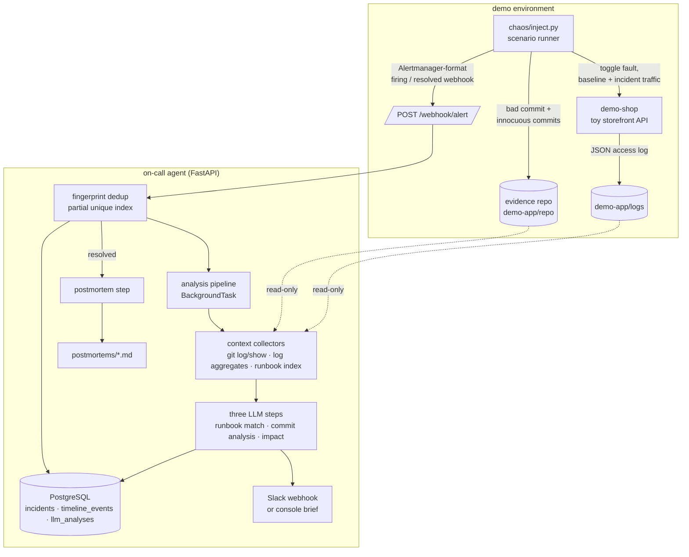

# On-Call Agent

[](https://github.com/kevinkiyosepyo/oncall-agent/actions/workflows/ci.yml)

An autonomous incident response agent. When a production alert fires, it pulls
context (recent commits, service logs, runbooks), uses Claude to identify the
likely bad commit, match the right runbook, and estimate blast radius, then
posts a structured incident brief to Slack. When the alert resolves, it
generates a postmortem.


**Status: v1 complete and measured** — 12/12 on the end-to-end eval suite,
including a no-culprit negative control. A
chaos scenario stages a real incident: it buries a genuinely bad commit in the demo service's git history,
degrades the running service, and fires an Alertmanager-format alert. The
agent pulls context (commits + diffs, access-log aggregates, runbooks), runs
three LLM triage steps, posts a structured brief, and — when the alert
resolves — writes a postmortem with timeline, root-cause hypothesis, and
action items.

## Run it

```sh
cp .env.example .env   # add ANTHROPIC_API_KEY; SLACK_WEBHOOK_URL optional
docker compose up --build -d
```

Stage a full incident lifecycle (host needs only python3 and git):

```sh
python3 chaos/inject.py high-error-rate --resolve-after 60
python3 chaos/inject.py --list        # available scenarios
python3 chaos/inject.py reset         # turn all faults off
```

Within ~20 seconds the incident brief appears in Slack — or in
`docker compose logs agent` when `SLACK_WEBHOOK_URL` is unset — naming the
suspect commit (with the mechanism connecting its diff to the observed
errors), the matched runbook, and a blast-radius estimate. On resolve, a
postmortem lands in `postmortems/`.

Each scenario prints its expected outcome (`expected: runbook=...
culprit=...`) so a run is self-checking. Re-firing while an incident is open
dedupes by alert fingerprint and skips re-analysis.

Inspect incident state at any point:

```sh
curl -s localhost:8080/incidents | jq
curl -s localhost:8080/incidents/<id> | jq   # includes the event timeline
```

## What a run looks like

Unedited output from `python3 chaos/inject.py high-error-rate --resolve-after 55`
(the injected bug: a commit that swaps a safe `DISCOUNTS.get(code, NO_DISCOUNT)`
lookup for `DISCOUNTS[code]`, buried under an unrelated docs commit):

```
🔴 INCIDENT BRIEF: HighErrorRate — demo-shop
severity: critical   endpoint: /checkout

*Impact:* 💥 sev1 · single_endpoint · affected: POST /checkout
~72.7% of checkout requests failing (baseline 0%)

*Suspect commit:* 🔎 `6c56805` (high confidence)
Changed apply_discount to directly index DISCOUNTS[code] instead of using
.get() with a default... Any checkout request with a discount_code not
present in DISCOUNTS (including None, the default value) now raises a
KeyError instead of falling back to NO_DISCOUNT, causing a 500 on /checkout.
> diff:  `-    discount = DISCOUNTS.get(code, NO_DISCOUNT) if code else ...`
> error: `KeyError: None in apply_discount (pricing.py, in apply_discount)`

*Runbook:* 📖 `runbooks/high-error-rate.md` (high confidence)
```

Full artifacts from this exact run: [the incident brief](examples/brief-high-error-rate.txt)
and [the generated postmortem](examples/postmortem-high-error-rate.md) —
timeline, root-cause hypothesis, prioritized action items, and per-step LLM
token/latency stats.

## Measured accuracy

`chaos/eval.py` runs every scenario end to end and scores the agent against
the ground truth the scenario planted. Each run seeds a fresh evidence repo
(new commit SHAs, new traffic), so this measures analysis, not memorization.
Verbatim output from `python3 chaos/eval.py` (2026-07-02):

```
scenario                   runbook   culprit   postmortem
--------------------------------------------------------
db-pool-exhausted          PASS      PASS      PASS
high-error-rate            PASS      PASS      PASS
high-latency               PASS      PASS      PASS
payment-provider-outage    PASS      PASS      PASS
--------------------------------------------------------
12/12 checks passed
```

Two things keep this honest:

- `culprit` requires the exact planted commit SHA, and the scenarios bury the
  bad commit beneath an unrelated one — so "blame HEAD" fails.
- `payment-provider-outage` is a **negative control**: the fault is external
  (provider timeouts) and no bad commit is planted. The agent passes only by
  reporting `no_culprit_found` with alternative hypotheses — so "always blame
  some commit" also fails. (The trap is real: the error names `payments.py`,
  and the innocuous initial-import commit did introduce that file.)

## Tests

Unit tests cover the log-window aggregation, runbook indexing (including
path-traversal rejection), the runtime-enum schema builders, the git
collector, and the postmortem renderer. Integration tests exercise the
ingest lifecycle against real Postgres, including the partial unique index
that enforces one open incident per alert fingerprint.

```sh
docker compose up -d postgres          # integration tests use :5433
pip install "./agent[dev]"
cd agent && python -m pytest
```

## Architecture



A real Prometheus/Alertmanager is a drop-in for the injector — the webhook
payload format is identical.

Design choices worth noting:

- **The agent analyzes real evidence.** The chaos runner commits an actual
  bad change (unsafe dict lookup, N+1 query, pool downsizing) to the demo
  service's repo — deliberately *not* as HEAD — and the runtime fault
  produces error strings consistent with that diff. Commit analysis works on
  genuine `git show` output.
- **Structured outputs as a correctness tool.** The runbook matcher and
  commit analyzer constrain their key fields to runtime-built enums (the
  actual runbook filenames, the actual commit SHAs), so a hallucinated
  runbook or invented SHA fails schema validation instead of reaching the
  brief.
- **Python counts, the model interprets.** Log aggregation (error rates,
  latency percentiles, baseline-vs-incident windows split at the alert's
  startsAt) happens in Python; the impact step receives numbers, not raw
  logs.
- **Failure degrades, never crashes.** Every LLM call is recorded in
  `llm_analyses` (model, tokens, latency, output or error); a failed step
  yields a brief with that section marked unavailable.
- **Postmortem structure is code, not prose.** The model fills structured
  sections; the markdown skeleton, ordering, and every timestamp come from
  the database.

Models: `claude-sonnet-5` for commit analysis and postmortem generation,
`claude-haiku-4-5` for runbook matching and impact estimation (per-step,
configurable in `agent/app/config.py`). A full incident lifecycle runs about
$0.05 in API usage.
